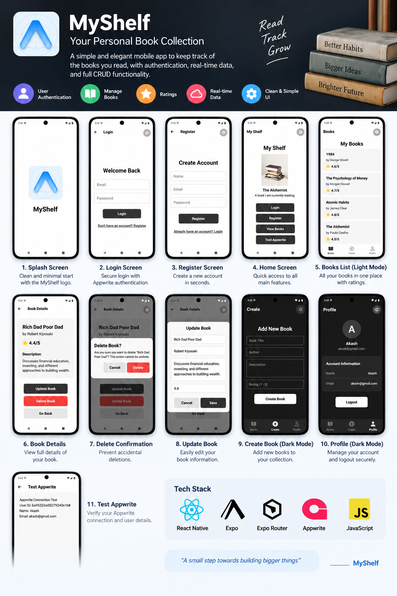

# 📚 MyShelf — Mobile Book Management App

MyShelf is a **React Native mobile application** built with **Expo**, **Expo Router**, and **Appwrite**.



The project is a practical book-management app that demonstrates authentication, book CRUD operations, FlatList rendering, real-time data, dynamic routes, and a tab-based dashboard.

---

## 📱 App Overview

MyShelf allows users to:

- 🔐 Register and log in
- 📚 View a collection of books
- ➕ Create new book records
- 📖 Open individual book details
- 🗑️ Delete books
- ⚡ Receive real-time database updates
- 👤 Access a profile screen
- 🧭 Navigate using Expo Router
- 🌙 Support light/dark navigation themes

---

## 🛠️ Technologies Used

| Technology | Purpose |
| --- | --- |
| **React Native** | Mobile application development |
| **Expo** | Development and build platform |
| **Expo Router** | File-based navigation |
| **Appwrite** | Authentication, database and real-time backend |
| **JavaScript / JSX** | Application logic and UI |
| **TypeScript** | Used by the Appwrite test screen |

---

## 📂 Project Structure

The current project uses the following Expo Router structure:

```text
MyShelf-Mobile-App/
│
├── app/
│   │
│   ├── (app)/
│   │   ├── index.jsx
│   │   └── test-appwrite.tsx
│   │
│   ├── (auth)/
│   │   ├── _layout.jsx
│   │   ├── login.jsx
│   │   └── register.jsx
│   │
│   ├── (dashboard)/
│   │   └── (tabs)/
│   │       ├── _layout.jsx
│   │       ├── books.jsx
│   │       ├── create.jsx
│   │       └── profile.jsx
│   │
│   ├── book/
│   │   └── [id].jsx
│   │
│   ├── _layout.jsx
│   └── ...
│
├── assets/
│   └── img/
│       ├── app-showcase.png
│       └── book-dark.png
│
├── components/
├── constants/
├── hooks/
├── package.json
└── README.md
```

---

## 🧭 Navigation

MyShelf uses **Expo Router's file-based routing system**.

### Authentication Routes

```text
(auth)/
├── _layout.jsx
├── login.jsx
└── register.jsx
```

The authentication section handles:

- User registration
- User login
- Authentication navigation

### Dashboard Routes

```text
(dashboard)/
└── (tabs)/
    ├── _layout.jsx
    ├── books.jsx
    ├── create.jsx
    └── profile.jsx
```

The dashboard contains three main tabs:

| Screen | Purpose |
| --- | --- |
| `books.jsx` | Displays the user's books |
| `create.jsx` | Creates a new book |
| `profile.jsx` | User profile and account actions |

### Dynamic Book Route

```text
book/
└── [id].jsx
```

`[id].jsx` is an Expo Router **dynamic route**.

It allows different book records to be opened using their unique IDs.

Example:

```text
/book/123
/book/456
/book/789
```

---

## ☁️ Appwrite Backend

MyShelf uses **Appwrite** as its backend.

Appwrite provides:

- 👤 User authentication
- 🗄️ Database storage
- 📚 Book records
- ⚡ Real-time database updates

The application communicates with Appwrite to create, fetch, and delete book records.

> **Important:** Never commit private API keys, secrets, or sensitive credentials to GitHub.

---

## 🔐 Authentication

The application separates authentication screens from the main dashboard.

```text
                    MyShelf
                       │
              ┌────────┴────────┐
              │                 │
        Not authenticated    Authenticated
              │                 │
            (auth)          (dashboard)
              │                 │
       ┌──────┴──────┐     ┌────┴─────┐
       │             │     │          │
     Login        Register Books    Profile
                              │
                            Create
                              │
                        Book Details
```

---

## 📚 Book Management

The project demonstrates the core book-management workflow.

### Create Books

New books are created from:

```text
app/(dashboard)/(tabs)/create.jsx
```

### Fetch Books

The books screen retrieves records from Appwrite:

```text
app/(dashboard)/(tabs)/books.jsx
```

### Display Books with FlatList

The book collection can be efficiently rendered using React Native's `FlatList`.

### View a Single Book

Individual records are accessed through:

```text
app/book/[id].jsx
```

### Delete Books

Book records can be deleted from the application through Appwrite.

---

## ⚡ Real-Time Data

Appwrite real-time functionality allows the app to respond to database changes.

For example:

```text
Book Created
     ↓
Appwrite Database
     ↓
Real-Time Event
     ↓
MyShelf
     ↓
Book List Updates
```

This avoids relying only on manually refreshing the screen.

---

## 🎨 Theming

The application supports light/dark mode handling for the navigation experience.

The project uses reusable theme-related components and constants to keep the UI consistent.

---

## 🧩 Expo Router Concepts Demonstrated

### Route Groups

Folders surrounded by parentheses are route groups:

```text
(auth)
(dashboard)
(tabs)
```

They help organize navigation without adding the group name to the URL.

### Layout Files

Files named `_layout.jsx` define navigation layouts for their respective routes.

Examples:

```text
app/_layout.jsx
app/(auth)/_layout.jsx
app/(dashboard)/(tabs)/_layout.jsx
```

### Dynamic Routes

```text
book/[id].jsx
```

The `[id]` segment dynamically represents a book ID.

---

## 🚀 Getting Started

### 1. Clone the repository

```bash
git clone https://github.com/akash-uppula/MyShelf-Mobile-App.git
```

### 2. Enter the project

```bash
cd MyShelf-Mobile-App
```

### 3. Install dependencies

```bash
npm install
```

### 4. Start Expo

```bash
npx expo start
```

You can then open the app using:

- Android Emulator
- iOS Simulator
- Expo Go
- A development build

---

## ⚙️ Appwrite Setup

Before running the complete application, configure your Appwrite project.

You will need to configure the backend resources expected by the app, including:

- Appwrite project
- Platform
- Authentication
- Database
- Books collection
- Required collection attributes
- Collection permissions
- Real-time access where required

Keep environment-specific or sensitive configuration outside the public repository.

---

## 🧪 Useful Commands

Start the development server:

```bash
npm start
```

Start Expo:

```bash
npx expo start
```

Clear the Expo cache:

```bash
npx expo start --clear
```

Run on Android:

```bash
npm run android
```

Run on iOS:

```bash
npm run ios
```

Check installed dependencies:

```bash
npm ls
```

---

## 🐛 Troubleshooting

### Clear Expo Cache

If navigation, bundling, or dependency changes are not being reflected:

```bash
npx expo start --clear
```

### Reinstall Node Modules

On Windows PowerShell:

```powershell
Remove-Item -Recurse -Force node_modules
npm install
```

On macOS/Linux:

```bash
rm -rf node_modules
npm install
```

---

## 📖 Learning Topics Covered

This project demonstrates:

- React Native fundamentals
- Expo
- Expo Router
- File-based routing
- Route groups
- Layout routes
- Dynamic routes
- Authentication
- Appwrite
- Database operations
- Creating records
- Fetching records
- Fetching single records
- Deleting records
- FlatList
- Real-time data
- Tab navigation
- Reusable components
- Light/dark theme handling

---

## 🔗 Repository

**GitHub:**  
https://github.com/akash-uppula/MyShelf-Mobile-App

---

## 👨‍💻 Author

**Akash Uppula**

GitHub:  
https://github.com/akash-uppula

---

## 📄 License

This project is primarily intended for learning and personal development.

If you plan to distribute it as an open-source project, add an appropriate license such as MIT.
